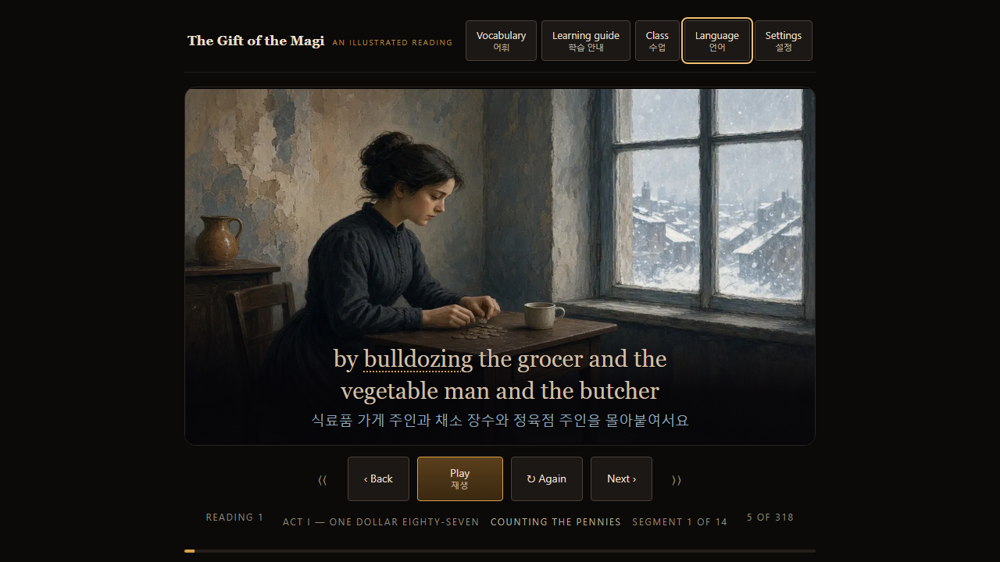
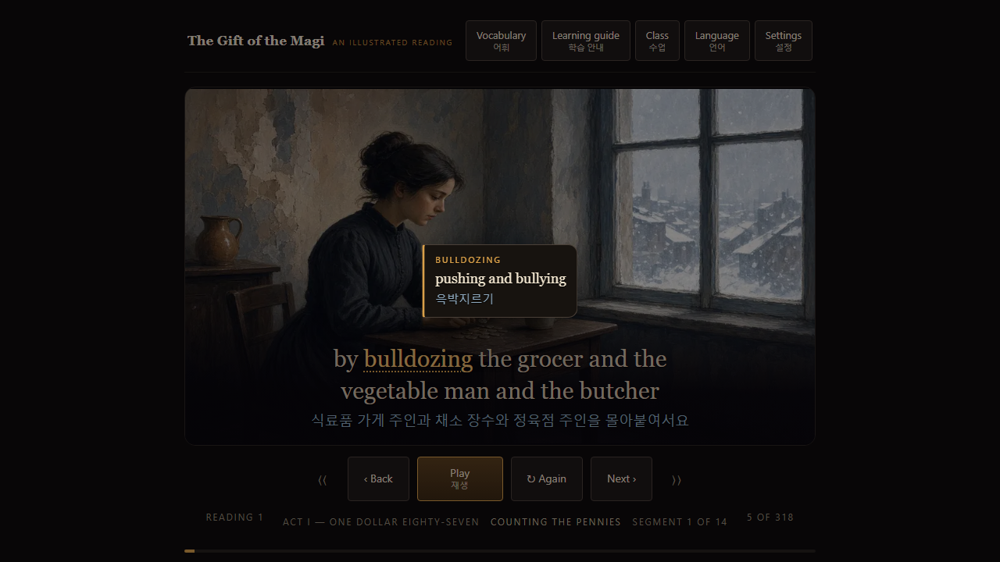
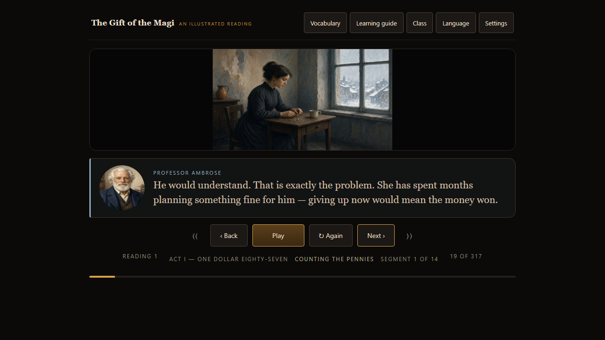
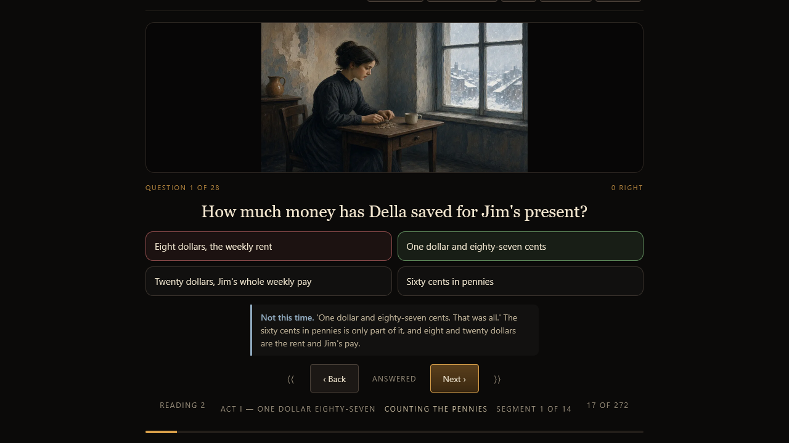
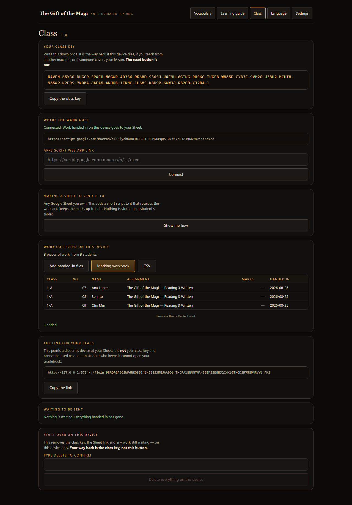

# Magi Reader

An illustrated reading engine for language classrooms.

A public-domain story becomes a narrated, illustrated reading. The class goes
through it three times — watch, questions, writing — and the work lands in the
teacher's spreadsheet already half marked.

The name comes from the first book, *The Gift of the Magi*. The engine does not
care which book it is. A second title is a new folder. The second title is *The
Raven*.



## For a student

The story is read aloud, line by line. The spoken word lights up from the media
clock and a WebVTT file, not from a timer. Hard words are tappable in English
and in the student's language. The whole interface can sit in Korean, Japanese,
Thai or Spanish *under* the English, not instead of it.

Place is remembered. Answers survive a reload. Hand-in is one button.

## For a teacher

Set up a class on any device. Nothing to log in to.

Work arrives in a Google Sheet, or — if there is no Google in the room — in
files that become a marking workbook. That workbook groups written answers by
question, not by student. Marking thirty answers to one prompt needs one
standard in your head.

|                                                                             |                                                                                  |
| --------------------------------------------------------------------------- | -------------------------------------------------------------------------------- |
|  |  |
| A glossed word, in two languages                                            | Two characters, one at a time                                                    |
|      |   |
| An answer is final, and explains itself                                     | The teacher's side, end to end                                                   |

## Run it

```bash
npm install
npm run dev            # the reader
npm test               # 480 unit tests
npm run e2e            # 635 end-to-end, four browser engines
npm run release        # verify, then build an uploadable zip
```

`npm run release` will refuse a zip the host would reject. It has already
caught a package with too many files in it.

## Layout

```
src/lib/            no DOM, no React, no timers
  book/             pack contract, translation lookup
  reader/           readings, beats, questions, grading
  speech/           who says what, and when
  class/            identity, class key, outbox, sending
  gradebook/        submissions → rows → CSV → .xlsx
  media/            WebVTT, lining a transcript up with the text
src/ui/             React. Presentation only.
src/books/<id>/     a book pack
src/backend/        Apps Script a teacher pastes into their Sheet
legacy/             the single-file prototype
tools/              extract, check, release
```

`src/lib` being pure is why a 2,685-question sweep runs in under a second, and
why a student attempt can be replayed in a test without drawing anything.

`src/engine.test.js` walks every source file outside `src/books/` and fails if
one names a book or hard-codes where that book keeps its audio.

Prefer platform features over inventions. `<dialog>`, `popover`, `<progress>`,
WebVTT, the History API. The three worst bugs in this project were all homemade
versions of something the browser already had.

## The prototype is the spec

`legacy/index.html` is the last working single-file reader: 1.68 MB, frozen,
guarded by a test that fails if the file changes. The `prototype` branch has
the snapshots that got it there. The last commit on that branch and
`legacy/index.html` on `main` are the same bytes.

Every defect found by attacking the original is a test here, written before the
equivalent piece was rebuilt:

| test              | what it stops |
| ----------------- | ------------- |
| formula injection | `=HYPERLINK(...)` in a student answer running when the sheet opens |
| leading zeros     | student `01` and `1` collapsing into one person in Excel |
| date coercion     | a score of `9 / 10` read as 9 October |
| written totals    | perfect writing scoring 67% because questions were counted twice |
| resubmission      | a better grade replaced by a blank |
| substitution      | `craved` / `coveted` used as each other's distractor |
| endpoint shape    | a doctored class key sending a class's writing to a stranger's script |
| modal keyboard    | arrow keys driving the reading behind an open panel |

That last one came back twice — once as a `<dialog>`, once as a `popover`.
Same test caught both.

## Other things that matter in a classroom

Tests run on Chromium, WebKit-as-iPad, Chromium-as-phone, and real Firefox.
Some bugs exist on exactly one of those. An invisible popover ate taps on the
iPad and nowhere else.

The class key is Crockford base32 so it survives paper and wrong-case typing.
The student link carries no identity and cannot open the gradebook.

A student is never told a hand-in failed. They cannot fix the network. The work
is written down first; retry is silent.

## Licence

MIT. The stories are public domain. Illustrations and recordings travel with
the book pack.
