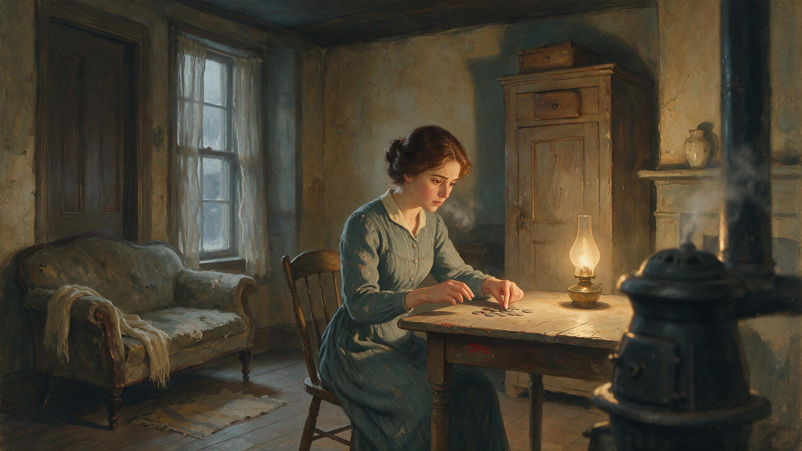

# Magi Reader

**A film to watch. A story to read.**

O. Henry’s *The Gift of the Magi*, adapted into a narrated short film and a quiet, installable reading app.

[**Open the app**](https://dancockrell.github.io/magi-reader-engine/) · [**Watch the film**](https://dancockrell.github.io/magi-reader-engine/film.html) · [**Download the 1080p film**](https://github.com/dancockrell/magi-reader-engine/releases/download/v0.9.6-portfolio/the-gift-of-the-magi.mp4)

[](https://dancockrell.github.io/magi-reader-engine/film.html)

## The experience

- **Watch:** the complete narrated film, with English captions, seeking, volume and fullscreen controls.
- **Read:** the original story at your own pace, with vocabulary support.
- **Keep a bookshelf:** one adaptation is the focus. Other titles are deferred.
- **Install:** use your browser’s install-app command where supported. The film streams on demand; downloading the MP4 is the reliable offline viewing option.

No account, classroom workflow, explanatory host characters, or sentence-driven video playback.

## The work behind the film

This is a portfolio project by **Dan Cockrell**, combining application development with an AI-assisted film production workflow. Generated footage was treated as source material: selected, rejected, reshot and cut into an authored timeline.

Picture, narration and music are baked into one film. The application does not stretch clips, loop shots or pause picture to catch individual sentences. The v0.9.6 delivery is **1920 × 1080 at 24 fps**, approximately **14 minutes 51 seconds** including titles and the closing coda.

[Read the production case study](docs/FILM-PRODUCTION.md) · [Release checks](docs/PORTFOLIO-RELEASE.md)

## Run locally

```sh
npm ci
npm run dev
npm test
npm run typecheck
npm run build
```

The repository includes reading media and captions. Download the film from Releases and place it at `public/video/films/magi-reader-film-final.mp4` for local playback. Production builds use the release-hosted film; set `VITE_FILM_URL` to supply a different delivery URL.

The app is `index.html`; the standalone cinema presentation is `film.html`. Both are built together. Raw generations and intermediate renders are kept outside the shipped app.

## Credits and license

Story: **O. Henry**. Adaptation, editing and application: **Dan Cockrell**. Visuals, narration and score use AI-assisted production.

Application code is MIT licensed. The story is public domain in the United States. Generated media is separate from the code license; contact the project author about reuse.


## Project history

[Historical teaching design](docs/PEDAGOGY.md) preserves earlier classroom research; it is not the current app specification. The film-first solo reader supersedes that interface without erasing its Git history.
